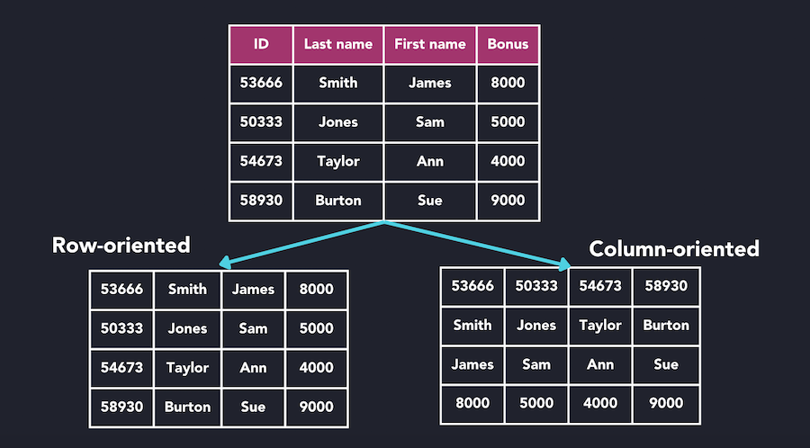

# ClickHouse

ClickHouse is a high-performance, column-oriented SQL database management system (DBMS) for online analytical processing (OLAP)

## 1. Column-oriented

In a row-oriented database (PostgreSQL, MySQL, etc.), consecutive table rows are sequentially stored one after the other. This layout allows to retrieve rows quickly as the column values of each row are stored together.

In column-oriented databases, tables are stored as a collection of columns, the values of each column are stored sequentially one after the other.
 
 - Harder to restore single rows
 - Much faster column operations such as filters or aggregation

The values of each column are stored sequentially one after the other on disk, so no unnecessary data is loaded. This is much faster compared to row-based storage, where entire rows (including irrelevant columns) are read

## 2. SQL