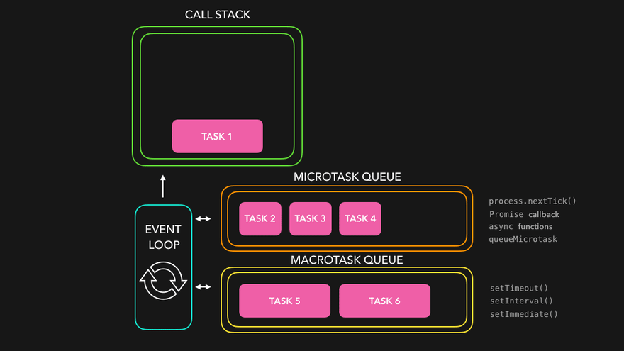
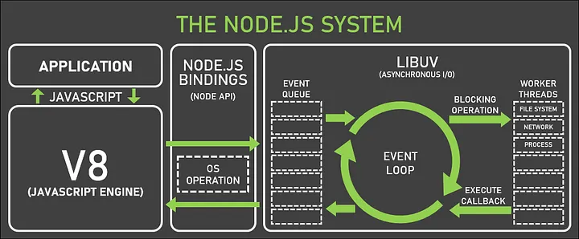

# JavaScript Concurrency Model

References

- [The Node.js Event Loop](https://nodejs.org/en/learn/asynchronous-work/event-loop-timers-and-nexttick#timers)
- [Node.js animated: Event Loop](https://dev.to/nodedoctors/an-animated-guide-to-nodejs-event-loop-3g62)
- [Promises](https://developer.mozilla.org/en-US/docs/Web/JavaScript/Reference/Global_Objects/Promise)

JavaScript, particularly in the browser and Node.js, runs in a single-threaded environment, meaning only one task is executed at a time. To handle I/O or timers efficiently without blocking the main thread, it uses the event loop along with Web APIs or Node APIs.

## 1. Key Components

### Call Stack

- Executes your code function by function. Operates in LIFO (Last-In-First-Out) order.
- If a function calls another, the new function is pushed onto the stack.

### Web APIs (Browser) / Node APIs

- These are provided by the browser or Node.js, not part of JavaScript itself. 
- For examples: setTimeout, DOM events, HTTP requests, etc. When you use setTimeout, the timer is managed by the Web API environment, not the JS engine.

### Callback Queue (Task Queue)

- Once the Web API finishes a task (like a timer), it moves the associated callback to this queue.

#### Microtasks vs Macrotasks

The event loop processes microtasks before any macrotasks after each execution context

### Event Loop

- Constantly monitors the call stack and the callback queue.
- If the call stack is empty, it pushes the next function from the callback queue onto the call stack.

## 2. Promises

## 3. NodeJS Event Loop

- V8 Engine: Memory Heap, Call Stack
- libuv: Event Loop

### Worker Pool