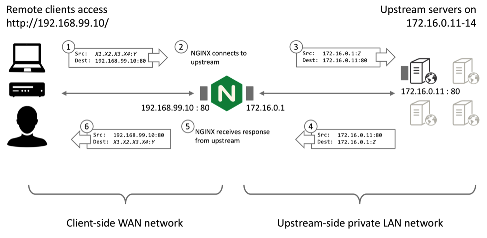

# Load Balancing & WebSocket

A load‑balancing device may work in two fundamentally different modes, and the chosen mode determines whether it merely routes the traffic or creates its own upstream connection.

- **Proxy Mode**: Execute on layer 7 (application)
- **Transparent Mode**: Execute on layer 4 (transport), using information defined at the networking transport layer as the basis for deciding how to distribute client requests across a group of servers (source and destination IP addresses and ports).

## 1. Proxy Mode



This approach enables rich routing rules (path‑based, header‑based, JWT inspection), TLS termination/offload, sticky sessions implemented by cookies, and advanced observability. 

- It also brings significant performance gains and efficiencies for HTTP and TCP traffic (including TCP optimizations, buffering, and HTTP keepalive reuse). 
- The trade‑off is extra latency, additional resource usage, and the need for scaling the proxy layer itself.

## 2. Transparent Mode

The Layer 7 reverse proxy mode of operation poses a challenge if the upstream server needs to determine the true origin IP address of the connection or session, for purposes such as authentication and access control, rate limiting, and logging.

### NGINX IP Transparency

The intention of IP Transparency is to conceal the presence of the reverse proxy so that the origin server observes that the IP packets originate from the client's IP address. IP Transparency can be used with TCP‑based and UDP‑based protocols.

```
```

## 3. Using WebSocket with LB

### Sticky Session (Affinity)

## 4. LLM Services Design

A common architecture for a long‑running, token‑streaming workflow can be described as a two‑stage pipeline: an ingress layer that owns the Server‑Sent Events (SSE) socket and a worker tier that performs the heavy computation.

### Message Queue

A message‑queue or event‑stream is typically inserted between those two stages to decouple them and to provide elasticity, ordering guarantees, and back‑pressure control.

## References

- [F5 | What Is Layer 4 Load Balancing?](https://www.f5.com/glossary/layer-4-load-balancing)
- [NGINX | Load Balancing](https://nginx.org/en/docs/http/load_balancing.html)
- [NGINX | IP Transparency and DSR Tutorial](https://www.f5.com/company/blog/nginx/ip-transparency-direct-server-return-nginx-plus-transparent-proxy)
- [Socket.IO | Using multiple nodes](https://socket.io/docs/v4/using-multiple-nodes/)